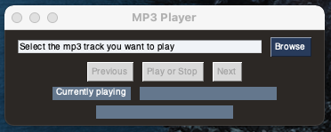

# MP3Player

This is a simple (very) mp3 player written in Python

# Requirements

- PySimpleGUI~=4.32.1
- pygame~=2.0.0

# Using the player

- Run the mp3_player.py file

- Click "Browse" to select song(s) you wish to listen to  
  

- Play or Pause the song using the "Play or Stop" button

- Use the "Previous" and "Next" buttons to select the previous and
  the next song respectively
